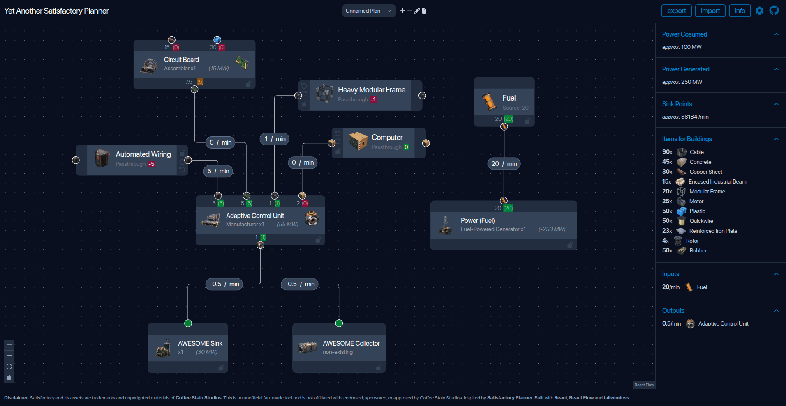

# Satisfactory Planner

> **Disclaimer:** This project is not affiliated with Coffee Stain Studios. “Satisfactory” and related assets/trademarks are the property of Coffee Stain Studios.

This is another planner for [Satisfactory](https://www.satisfactorygame.com/) for sketching production chains, inspired by [satisfactory-planner.vercel.app](https://satisfactory-planner.vercel.app/), and extended with additional features.

Live version: https://ironblood.github.io/satisfactory-planner

The screenshot above was generated from [example.json](./assets/example.json).

## Features

Some features are similar to the original Satisfactory Planner:

- Double-click any empty area to open the picker dialog, where you can choose the item to produce and the recipe to use.
- Delete a selected node or edge with the <kbd>Del</kbd> key.
- Drag from a handle to connect to another node or create a new node.
- Adjust node multipliers to reduce graph clutter.
- Supports source nodes and passthrough nodes.
- Highlights connected edges when a node is selected.

These features differ:

- Supports multiple plans with import and export as JSON files. Plan names and export filenames can be renamed.
- Summarizes approximate power consumption, power generation, building material requirements, sink points, and outputs.
- Items in the picker dialog are organized by category.
- Coal and fuel generators can be added directly from the Buildings category, while nuclear power plants can be added through nuclear recipes, allowing power plants to be planned in this tool.
- Node and edge values are edited manually; connected values are not recalculated automatically. This differs from the original Satisfactory Planner.
- Flow mismatches are highlighted directly in the graph:
  - Red means inputs are insufficient or outputs are overdrawn.
  - Yellow means inputs are overprovided or outputs are not fully used.
  - Green means the flow is balanced.
- Supports locking node position and rate values.
- Supports rotating passthrough nodes.

## Running Locally

To run this project locally:

1. Make sure `git`, `node.js`, and `pnpm` are installed.
2. Clone this repository.
3. Run `pnpm install` to install dependencies.
4. Run `pnpm dev` and open `http://localhost:5173`.
5. If port `5173` is already in use, Vite will choose another port and print the correct URL in the terminal.

To build a static production version, run `pnpm build`.

## Contributions

This project is still in an early stage and may contain bugs, missing features, incorrect recipe data, or UI and performance issues on large flows. Bug reports, data corrections, feature suggestions, and pull requests are welcome.

This project is built with React, React Flow, Tailwind CSS, and Headless UI.

## License

- Original source code in this repository is licensed under MIT.
- Game-related assets and data are not covered by MIT. See [ATTRIBUTION.md](./ATTRIBUTION.md) for details.
